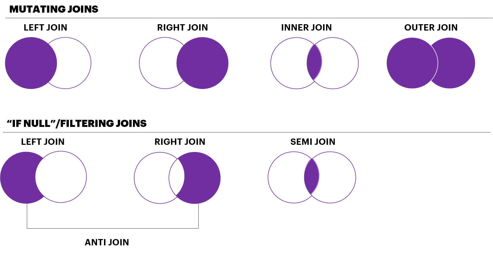

*** 

```{r results="asis", echo=FALSE}
cat("
<style>
@import url('https://fonts.googleapis.com/css?family=Raleway:400,600');

body{
	font-family: 'Raleway';
}
.title{
text-align:center;
text-transform:uppercase;
font-weight:700
}
.row{
display:none;
}
#we-are-ready-for-the-fun-part-machine-learning{
text-align: center;
font-weight: 700;
text-transform: uppercase;
color: #8e44ad;
}
</style>
")
```
### **Install Packages** 
```{r Install Packages}
install.packages("rvest","stringr","dplyr","plyr","ggplot2","tidyr","caret","scales","gridExtra")
```

### **Load Libraries**
```{r message=FALSE }
library(rvest)
library(stringr)
library(dplyr)
library(plyr)
library(ggplot2)
library(tidyr)
library(caret)
library(scales)
library(gridExtra)
```

### **A website with holiday data is: timeanddate.com**
```{r}
url <- "https://www.timeanddate.com/holidays/"
```

### **Great, so how do we get the holidays for each country?**
Two options: Either we use the countries names to make the URLs or we know all the URLs for each countries

```{r}
links <- url %>%
 read_html %>% 
 html_nodes(".main-content-div .row a") %>% 
 html_attr("href")
```

### **Let's inspect what we have gotten**
```{r}
head(links)
tail(links)
```
### **We got the paths from the base URL and it also seems that the first two links are not country related so let's take it out**
```{r}
links <- links [3:length(links)]
links
```

### **Let's append the base URL to each path**
```{r}
links <- paste0("https://www.timeanddate.com",links)
links[1:10]
```

### **Let's extract the actual country names from the links using stringr and** [regex](https://www.rstudio.com/wp-content/uploads/2016/09/RegExCheatsheet.pdf)
```{r}
country <- stringr::str_replace_all(links,"https://www.timeanddate.com/holidays/","") %>%
str_replace_all(.,"[-/]"," ") %>%
  stringr::str_trim()
country[1:10]
```

### **Change from lower case to Title Case**
```{r}
country =stringr::str_to_title(country)
country[1:10]
```
### **We are going to write our own function to extract the number of holidays for each country using the holiday_per_country function below**
```{r}
holiday_per_country = function(index){
  require(rvest)
  require(dplyr)
holidays=try(links[index] %>% 
                      read_html %>% 
                      html_node(".zebra") %>% 
                      html_table %>% 
                       dplyr::filter((grepl(pattern = "Holiday",`Holiday Type`,ignore.case= T)==T))
                     ,silent = T)
  if(is.list(holidays)){
    return(c(country[index],nrow(holidays)-1))
  }
  else{
    return(c(country[index],0))
  }
}
```

### **Now, we will apply this function to each of links we have our a dataset**
```{r eval=FALSE}
################DO NOT RUN#######################
holiday_df=plyr::ldply(1:length(links),holiday_per_country)
names(holiday_df) = c("Country","no_of_holidays")
################DO NOT RUN#######################

```
```{r}
holiday_df = read.csv("holiday_df.csv")
holiday_df %>% dplyr::as_tibble()
```

### **We would use ggplot2 to inspect our data. For more info on how to use ggplot2, check out the** [ggplot2 Cheatseet](https://www.rstudio.com/wp-content/uploads/2015/03/ggplot2-cheatsheet.pdf) 
```{r}
holiday_df$no_of_holidays = as.numeric(holiday_df$no_of_holidays)
ggplot(holiday_df,aes(no_of_holidays))+
  geom_histogram(fill="seagreen3",color="black")+
  theme_classic()
```
### **Let's find out the exact countries that are the top outliers**
```{r}
holiday_df %>%
  arrange(-no_of_holidays)
```

###**Interesting, let's take a look at The** [US](https://www.timeanddate.com/holidays/us/)

You would see that a lot of their holidays are either State or County-observed. Do these types of holidays count if you are looking at the nation as a whole?
  

```{r}
 local_holidays = function(index) {  
   column_names=names(links[index] %>%
                                        read_html %>%
                                        html_node(".zebra") %>%
                                        html_table) %>% str_to_lower()
   if("where it is observed" %in%column_names  == T){ 
     country[index]
   }
 
 }

#We have two options of using this function

#Option 1: A for loop. 
#Pros: Ability to save intermediary result & Ability to create custom progress trackers
#Cons: Significantly slower & Code is less concise

```

```{r eval=FALSE}
################DO NOT RUN#######################
local_countries=NULL
for (i in 1:length(links)){
  ind=local_holidays(i)
  local_countries=append(local_countries,ind)
  print(i/length(links))
}

#Option 2: Vectorization using the lapply function
#Pros: Fast & Concise code
#Cons: Intermediary results are not saved & No custom progress function although some progressbar functionalities can be used with it
local_countries=lapply(1:length(links),local_holidays) %>% unlist
################DO NOT RUN#######################
```

```{r}
local_countries=c("Canada","Us","Australia","Indonesia","Philippines","United Arab Emirates","Germany","Spain","Switzerland","Uk")
```

### **Let's take a look at the countries that have these local holidays**
```{r}
paste("The Number of Countries with local 
      holidays:",length(local_countries))
local_countries
```

### **Let's get the number of national holidays for these countries**
```{r}
#Extract the index numbers for each of these countries
indices = which(country %in% local_countries)
updated_holidays= function (index){
  
table=links[index] %>% 
                read_html %>%
                html_node(".zebra") %>%
                html_table 
names(table)=names(table) %>%
  str_to_lower()
updated_table = table %>%
  filter( (grepl('holiday',`holiday type`,ignore.case =T) & 
             `where it is observed` == "" & grepl('jewish|Hindu',`holiday type`,ignore.case =T)==F) | grepl('all',`where it is observed`,ignore.case =T))
  return(c(country[index],nrow(updated_table)))
}
new_holiday = ldply(indices,updated_holidays)
names(new_holiday)=c("Country","no_of_holidays")
new_holiday=cbind(new_holiday,indices)
new_holiday
```

### **Now, let's replace the old holiday values with the new ones**
```{r}

for(i in indices){
holiday_df$no_of_holidays[i]=new_holiday$no_of_holidays[new_holiday$indices==i]
  
}

holiday_df=holiday_df %>%
  mutate(no_of_holidays=as.numeric(no_of_holidays)) 

holiday_df%>%
  filter(Country == "Canada") %>%
  as_tibble()
```

### **Let's check what we have left as outliers**
```{r}
holiday_df %>%
  arrange(-no_of_holidays)
```

### **Update actual holidays for the top 4 outliers**
```{r}
holiday_df$no_of_holidays[holiday_df$Country=="Bangladesh"]=21
holiday_df$no_of_holidays[holiday_df$Country=="India"]=18
holiday_df$no_of_holidays[holiday_df$Country=="Pakistan"]=20
holiday_df$no_of_holidays[holiday_df$Country=="Malaysia"]=20
```

### **Inspect again using our Histogram from before**
```{r}

ggplot(holiday_df,aes(no_of_holidays))+
  geom_histogram(fill="seagreen3",color="black")+
  theme_classic()
```

### **Let's check out those zeros**
```{r}
holiday_df %>%
  arrange(no_of_holidays)
```

### **Those are not countries so we will take them out**
```{r}
holiday_df=holiday_df %>%
  filter(no_of_holidays>0)
```

### **Let's also make sure that there no duplicates**
```{r}
holiday_df %>%
  group_by(Country) %>%
  dplyr::summarise(no_of_occurences=n()) %>%
  arrange(-no_of_occurences)
```

### **Let's investigate Russia**
```{r}
holiday_df %>%
  filter(Country=="Russia")
```

###**We would remove them using the distinct() function from dplyr**
```{r}
holiday_df=holiday_df %>%
  distinct(Country,no_of_holidays)
```

### **Let's check the dataframe after we have removed the duplicates**
```{r}
 holiday_df %>%
  group_by(Country) %>%
  dplyr::summarise(no_of_occurences=n()) %>%
  arrange(-no_of_occurences)
```


### **Let's look at a visual map of holidays in each country on a** [Tableau Dashboard](https://public.tableau.com/profile/rosebud.anwuri#!/vizhome/TheABC-XYZofDataScience/Sheet1?publish=yes)
 

### **Now, let's look at Life Expectancy data from The World Bank**
```{r}
life_expectancy_df = read.csv("Life Expectancy.csv")
life_expectancy_df
```

### **Using tidyr's gather() function we would collapse all these life expectancies into two columns i.e. A key-value format**
```{r}
life_expectancy_df = life_expectancy_df %>%
  gather(Year,life_expectancy,X2008..YR2008.:X2015..YR2015.) %>%
  select(-Country.Code)
life_expectancy_df
```

### **Let's tidy up these two columns**
```{r}
life_expectancy_df$Year=substr(life_expectancy_df$Year,2,5)
life_expectancy_df=life_expectancy_df %>%
  mutate(Year=as.integer(Year)) %>%
  mutate(life_expectancy=as.numeric(life_expectancy)) %>%
    mutate(Country.Name=as.character(Country.Name)) 
life_expectancy_df
```

### **Let's check for missing values**
```{r}
table(is.na(life_expectancy_df))

```
### **Let's remove all the NA's with R's complete.cases()**
```{r}
paste("Before NA removal:",nrow(life_expectancy_df))
life_expectancy_df=life_expectancy_df[complete.cases(life_expectancy_df),]
paste("After NA removal:",nrow(life_expectancy_df))
```
### **Let's compute the average life expectancy since 2008**
```{r}
life_expectancy_df=life_expectancy_df %>% 
  group_by(Country.Name) %>%
  dplyr::summarise(avg_life_expectancy=mean(life_expectancy))
life_expectancy_df
```

### **We would like to join the two tables but first let's see what the different types of joins mean**

 

### **Check for duplicates**
```{r}
life_expectancy_df %>%
  group_by(Country.Name) %>%
  dplyr::summarise(count=n()) %>%
  arrange(-count)
```

### **Some exploration of the distribution of Life Expectancy**
```{r}
ggplot(life_expectancy_df,aes(avg_life_expectancy))+
  geom_histogram(fill="violetred3",color="black")+
  theme_classic()
```
###**Let's investigate what countries are the lower end of the life expectancy**
```{r}
life_expectancy_df %>%
  arrange(avg_life_expectancy)

```

###**Let's also visualize a** [spatial map](https://public.tableau.com/profile/rosebud.anwuri#!/vizhome/TheABC-XYZofDataScience/Sheet2?publish=yes) for Life Expectancy


###**We want to join the holiday and the life expectancy data frames for countries that have both numbers of holidays and life expectancy. What Join will be most suitable for this?**
```{r}
 life_expectancy_df=life_expectancy_df %>%
    dplyr::rename(Country=Country.Name)
holiday_and_life = inner_join(holiday_df,life_expectancy_df,by="Country")
holiday_and_life
```

###We are ready for the fun part, **Machine Learning**!
***

###**Let's do some preprocessing like splitting the data into a training and test set using caret**
```{r}
country_data = read.csv("country_data.csv")
set.seed(1)
idx=createDataPartition(country_data$avg_life_expectancy,p=0.7,list = F)
train=country_data[idx,]
test=country_data[-idx,]
country_data
paste("Number of Observations for train is:",nrow(train),"& Number of Observations for test is:",nrow(test))

```

###**Some inital exploration of our data**
```{r}

p1=ggplot(country_data,aes(no_of_holidays,avg_gdp))+
  geom_point(color="violetred3",size=2)+
  ggtitle("Holidays")+
  theme_classic()
p2=ggplot(country_data,aes(Population,avg_gdp))+
  geom_point(color="#e67e22",size=2)+
  ggtitle("Population")+
  theme_classic()
p3=ggplot(country_data,aes(Health.expenditure..private....of.GDP.,avg_gdp))+
  geom_point(color="#3498db",size=2)+
  ggtitle("Health Expenditure")+
  theme_classic()
p4=ggplot(country_data,aes(Labor.force..total,avg_gdp))+
  geom_point(color="#1abc9c",size=2)+
  ggtitle("Labor Force")+
  theme_classic()
p5=ggplot(country_data,aes(Unemployment_Rate,avg_gdp))+
  geom_point(color="#34495e",size=2)+
  ggtitle("Unemployment Rate")+
  theme_classic()
p6=ggplot(country_data,aes(avg_life_expectancy,avg_gdp))+
  geom_point(color="#e74c3c",size=2)+
  ggtitle("Average Life Expectancy")+
  theme_classic()
grid.arrange(p1,p2,p3,p4,p5,p6)
```

###**Change to logarithmic scale**
```{r}
p1=ggplot(country_data,aes(no_of_holidays,log(avg_gdp)))+
  geom_point(color="violetred3",size=2)+
  ggtitle("Holidays")+
  theme_classic()
p2=ggplot(country_data,aes(log(Population),log(avg_gdp)))+
  geom_point(color="#e67e22",size=2)+
  ggtitle("Population")+
  theme_classic()
p3=ggplot(country_data,aes(Health.expenditure..private....of.GDP.,log(avg_gdp)))+
  geom_point(color="#3498db",size=2)+
  ggtitle("Health Expenditure")+
  theme_classic()
p4=ggplot(country_data,aes(log(Labor.force..total),log(avg_gdp)))+
  geom_point(color="#1abc9c",size=2)+
  ggtitle("Labor Force")+
  theme_classic()
p5=ggplot(country_data,aes(Unemployment_Rate,log(avg_gdp)))+
  geom_point(color="#34495e",size=2)+
  ggtitle("Unemployment Rate")+
  theme_classic()
p6=ggplot(country_data,aes(avg_life_expectancy,log(avg_gdp)))+
  geom_point(color="#e74c3c",size=2)+
  ggtitle("Average Life Expectancy")+
  theme_classic()
grid.arrange(p1,p2,p3,p4,p5,p6)
```

###**Let's carry out model selection**
```{r}
models = c("lm","rf","rpart","gbm")

set.seed(7)
model_selection = function(method_name){
  if(method_name=="rf"){
 garbage <- capture.output(
   
   model <-train(x= train[,c(2,4:9)], y = train[,3], method = method_name,importance=T)
   )
  }
  else{
 garbage <- capture.output(
   
   model <-train(x= train[,c(2,4:9)], y = train[,3], method = method_name)
   )
    
  }
return(model)

}
R2_metric = function(model){
  predTest=predict(model,newdata = test)
R2 = R2(predTest,test$avg_gdp)
return(c(model[["method"]],R2))
}
model_results = lapply(models,model_selection) 
models_r2 = model_results%>%
                    ldply(.,R2_metric)
names(models_r2) = c("model","r2")
models_r2 %>%
  mutate(r2=as.numeric(r2)) %>%
  arrange(-r2)
```

###**RandomForest did it best, let's take a look at the important variables**
```{r}
varImp(model_results[[2]])[["importance"]] %>%
  as.data.frame() %>%
  mutate(variables=row.names(.)) %>%
  ggplot(.,aes(x=reorder(variables,Overall),y= Overall ))+
  geom_bar(stat = "identity",fill="#16a085",color="#16a085")+
  coord_flip()+
  theme_classic()+ 
  xlab("Variables")+
  ylab("Weighted Importance")+
  ggtitle("Random Forest Variable Importance")+
  geom_text(aes(label=paste0(round(Overall,1),"%"),hjust=ifelse(Overall<90,-0.1,1)))
```


